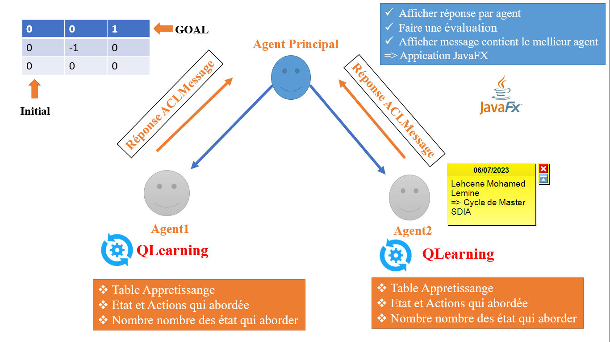
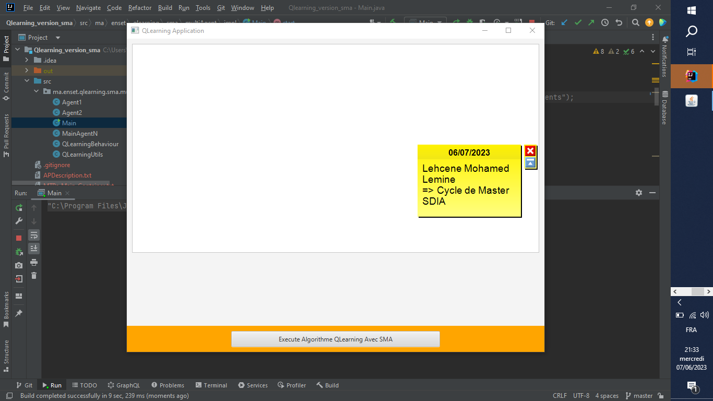
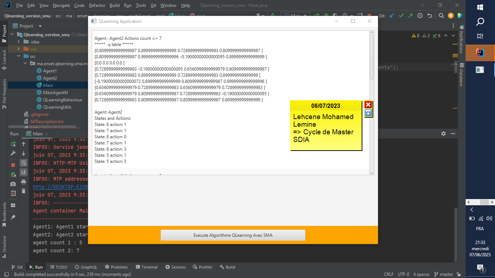

<h2>Lehcene Mohamed Lemine => Master SDIA ENSET MOHAMMEDIA</h2>
<h3>Architecture que j'ai abordé pour implementer cet Algorithme Q-Learning avec SMA.</h4>

<h3>Voici mon systéme qui permet d'execute cet Algorithme Q-Learning est démarer</h3>

<h3>Voici lorsque j'ai clique sur bouton qui permet de lancer d'execution cet algorothme il m'affiche ce resultat qui contient tableau d'apprentissage pour chacun des agnets , les états et les actions qui abordée pour atteindre état GOAL et les nombres des états qui executé et à la fin affiche un message qui contient quel l'agent est meilleur pour atteindre etat GOAL par le chemin le plus court.</h3>

